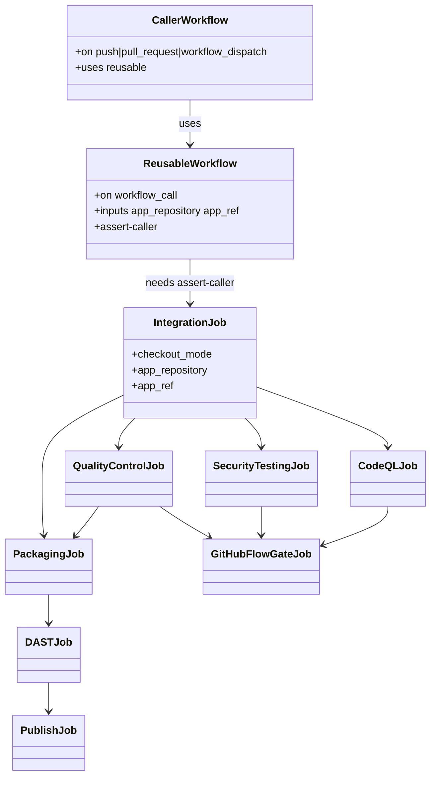

# REASONS Canvas: add-haystack-ci-pipeline

**Input analysis:** [add-haystack-ci-pipeline.md](../analysis/add-haystack-ci-pipeline.md)  
**Behavior contract:** [OpenSpec change](../../openspec/changes/add-haystack-ci-pipeline/)

When reality diverges, fix this prompt first — then update the YAML.

---

## R — Requirements

- Provide the same three-pipeline GitHub Flow family used by REST API, portal, and mobile, adapted for Heavy Rental haystack-fast-api (`Heavy-Rental/haystack-fast-api`).
- Fast Feedback: Integration only, feature-branch pushes (ignore `master`/`develop`). Sole Integration-stage run for that SHA.
- Integration CI: PR/push `develop` + `workflow_dispatch`. Jobs: Assert caller → Integration → (QC ∥ Security ∥ CodeQL) → GitHub Flow CI Gate. CI caller does not `uses:` Fast Feedback. On `pull_request`, Integration reuses a successful Fast Feedback run for the head SHA and skips uv/layout.
- Release: `workflow_dispatch` only (Actions → Haystack Release Pipeline Invoke). Jobs: Assert caller → Integration → QC → Packaging → DAST → Publish (public GHCR + GitHub Release). Do **not** use `on: release` — Publish creates the GitHub Release. SAST/CodeQL stay on Integration CI.
- Use **Python/Haystack tools only**: CPython 3.12, uv, Ruff, pytest, Haystack `Pipeline` constructors, Semgrep `p/python`, pip-audit report, CodeQL `python`.
- Specs (OpenSpec + this canvas) and YAML all live under `haystack-fast-api-pipeline/`.
- Install story: copy each caller + reusable pair into the application repo `.github/workflows/`.
- This family stops at packaging. Infrastructure, deploy, and operate belong to another project.

## E — Entities



Artifacts:

| Name | Source |
| --- | --- |
| uv fingerprint | `uv.lock`, `pyproject.toml` |
| Pytest HTML | `reports/pytest-report.html` |
| SARIF | `security-reports/semgrep.sarif`, `security-reports/semgrep-gha.sarif`, `security-reports/trivy-fs.sarif` |
| pip-audit | `security-reports/pip-audit.json` |
| Release wheel | `haystack-fast-api-v{version}-build{run}-{sha}.whl`, `haystack-fast-api.whl` |
| Release sdist | matching `.tar.gz` names |
| Release image tar | `haystack_recommender-image.tar.gz` (stable archive; GHCR tags are `<semver>` + `:latest`) |
| GHCR | `ghcr.io/{owner}/haystack_recommender:{x.y.z}` and `:latest` (Publish after DAST) |

## A — Approach

- Clone REST/mobile **orchestration** (header comments, `assert-caller` case on `github.workflow_ref`, Semgrep-safe source resolver, `APP_PATH: app`, artifact names, Fast Feedback reuse on PR).
- Replace toolchain: `actions/setup-python` **v7.0.0** (SHA-pinned) **3.12** + `astral-sh/setup-uv` **v10.0.1** (SHA-pinned, cache on `uv.lock`). Pin third-party actions to latest stable SHAs (`github/codeql-action` v4.37.8, `actions/github-script` v9.0.0, `actions/download-artifact` v8.0.1, `docker/login-action` v4.6.0, `actions/upload-artifact` v7.0.1).
- Integration resolve: `uv lock --check` then `uv sync --frozen --all-groups`, then a Haystack/FastAPI smoke (`create_app`, `build_indexing_pipeline`, `build_intake_front_pipeline`). Skip those steps on PR when Fast Feedback already succeeded for the head SHA.
- QC: `uv run ruff check app tests` then `uv run pytest tests/` with CI-safe Haystack env.
- Security: two Semgrep passes (app packs exclude `.github/**`; GHA pass `p/github-actions`; inherit ERROR except paid CD caller); `uvx pip-audit` report-only; Trivy FS two-pass + CRITICAL gate; CodeQL `python`.
- Release: `uv build`, then always-generated Python 3.12 + uv + uvicorn `app.main:app :8000` + `--extra neo4j` (app Dockerfile moved aside). Sanitize `.env.prod` → `/app/.env` (product knobs only). Refuse `ENV`/`ARG`, raw `COPY .env`, estate secrets (ADR 0008 / 0009). Do not read Environment `academy`. Prove dummy `-e` (process env wins) and `GET /docs` or `/health`. `COPY` sidecar dirs only if present. `docker save` tar for DAST; Publish pushes GHCR `haystack_recommender` and creates the GitHub Release. No Security Testing or CodeQL on Release.

## S — Structure

```
haystack-fast-api-pipeline/
  specification/                 # human index
  openspec/                      # behavior
  spdd/                          # this canvas
  fast-feedback-ci-pipeline/
    fast-feedback-pipeline.yml
    haystack-fast-feedback-caller.yml
  integration-pipeline/
    integration-pipeline.yml
    haystack-ci-caller.yml
  release-pipeline/
    release-pipeline.yml
    haystack-release-caller.yml
```

Install names (application repo):

| This repo | `.github/workflows/` |
| --- | --- |
| `haystack-*-caller.yml` | same filename |
| `*-pipeline.yml` | same filename (`fast-feedback-pipeline.yml`, `integration-pipeline.yml`, `release-pipeline.yml`) |

`DEFAULT_APP_REPOSITORY`: `Heavy-Rental/haystack-fast-api`.  
`DEFAULT_APP_REF`: `develop` (fast feedback + CI), `master` (release).

Job `name:` values (branch protection):

- `Assert caller`
- `Integration`
- `Quality Control`
- `Security Testing`
- `CodeQL Analysis`
- `GitHub Flow CI Gate`
- `Packaging` (release only)
- `DAST` (release only)
- `Publish` (release only)

## O — Operations

1. Write OpenSpec + OpenSPDD + `specification/` (this change; already required before YAML).
2. Write `integration-pipeline.yml` with jobs in this order: `assert-caller`, `integration`, `quality-control`, `security-testing`, `codeql`, `github-flow-gate`.
3. Write `haystack-ci-caller.yml` (`name: CI`, PR/push `develop`, `workflow_dispatch`, `security-events: write`).
4. Write fast-feedback pair (Integration only, `branches-ignore: [master, develop]`).
5. Write release pair (`workflow_dispatch` only; `cancel-in-progress: false`; Packaging + DAST + Publish). Do not use `on: release`.
6. Header-comment each file with install path, triggers, and local `actionlint` command under `haystack-fast-api-pipeline/`.
7. Bind every `github.*` / `inputs.*` / `needs.*.outputs.*` used in `run:` through `env:` (except GitHub-native `if:` expressions, which are not shell).
8. `actionlint` all six files.

## N — Norms

- `# ====...====` header block copied in spirit from REST/mobile (purpose, stages, install, secrets = none).
- `set -euo pipefail` on every multi-line `run:`.
- No `secrets: inherit`.
- No `environment:` on caller `uses:` jobs (invalid) and none on haystack QC.
- Third-party `uses:` MUST be SHA-pinned (40-char commit + `# tag` comment). Allowed: `actions/checkout@3d3c42e5aac5ba805825da76410c181273ba90b1` # v7.0.1 (`persist-credentials: false`), `actions/setup-python@5fda3b95a4ea91299a34e894583c3862153e4b97` # v7.0.0, `astral-sh/setup-uv@20cfd1bf945f4377ade1205e4dbc17946fc9a30d` # v10.0.1, `actions/cache@55cc8345863c7cc4c66a329aec7e433d2d1c52a9` # v6.1.0, `actions/upload-artifact@043fb46d1a93c77aae656e7c1c64a875d1fc6a0a` # v7.0.1, `aquasecurity/trivy-action@ed142fd0673e97e23eac54620cfb913e5ce36c25` # v0.36.0, `github/codeql-action/*@ff2f1c621b7f889edc0d3c761ac2e6a3f8cdb0dd` # v4.37.7, `docker/login-action@dbcb813823bdd20940b903addbd779551569679f` # v4.6.0 (release only). Mutable tags (`@v4`, `@v5`, `@v3`, `@v0.36.0`) are forbidden.
- uv invocations always `--frozen` for install (`uv sync --frozen --all-groups`).
- Write `$GITHUB_STEP_SUMMARY` tables for source resolution, Integration, QC, gate, packaging.
- SARIF is the security report standard; pip-audit JSON is a Python extra report; console tables are logs only.

## S — Safeguards (negative space)

- **DO NOT** start Postgres, pgvector, or Neo4j; **DO NOT** set `RUN_PGVECTOR_TESTS` or `RUN_NEO4J_TESTS`.
- **DO NOT** set `LLM_API_KEY` or call DigitalOcean Inference.
- **DO NOT** `uv sync --extra neo4j` on Fast Feedback / Integration / QC (test install). Release **image** install SHALL use `--extra neo4j`.
- **DO NOT** bake `SOURCE_*`, `TARGET_*`, `POSTGRES_*`, `DATABASE_URL`, `NEO4J_PASSWORD`, or `LLM_API_KEY` into the Release image (`ENV`/`ARG`/`COPY .env`/`--build-arg`). A sanitized `COPY haystack.prod.env .env` (product knobs only, estate keys stripped) is required.
- **DO NOT** add Docker build or `packages: write` on Fast Feedback or Integration CI.
- **DO NOT** treat an application Dockerfile as the deploy image. Release always generates uvicorn; an app Dockerfile is moved aside.
- **DO NOT** start Postgres, Neo4j, or call an LLM during `docker build`.
- **DO NOT** `docker push` from Packaging (Publish pushes after DAST).
- **DO NOT** subscribe the Release caller to `release` or `pull_request` events.
- **DO NOT** add a Mock Contract Tests / Prism / Node job.
- **DO NOT** add a fourth pipeline (including scheduled model retrain — product OpenSpec, not this family).
- **DO NOT** provision infrastructure, apply IaC, or create cloud resources in this family.
- **DO NOT** deploy packaged artifacts onto a runtime in this family.
- **DO NOT** add operate jobs (monitor, page, remediate production) in this family.
- **DO NOT** implement infrastructure, deploy, or operate workflows in this change — they belong to another project.
- **DO NOT** put `on: push` / `pull_request` / `workflow_dispatch` on reusable files.
- **DO NOT** interpolate `${{ github.* }}` or `${{ inputs.* }}` inside `run:` script bodies.
- **DO NOT** change REST API, portal, mobile, or the application product `openspec/`.
- **DO NOT** cancel in-progress Release runs.
- **DO NOT** require GitHub Environments or repository secrets in v1.
- **DO NOT** use Java, Maven, Gradle, npm, or Android SDK actions.
