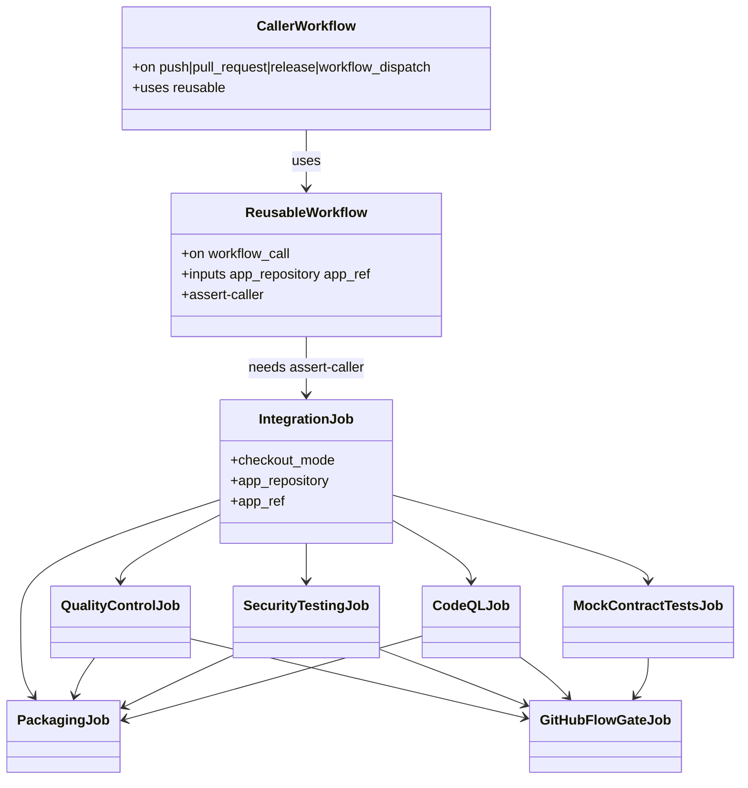

# REASONS Canvas: add-mobile-ci-pipeline

**Input analysis:** [add-mobile-ci-pipeline.md](../analysis/add-mobile-ci-pipeline.md)  
**Behavior contract:** [OpenSpec change](../../openspec/changes/add-mobile-ci-pipeline/)

When reality diverges, fix this prompt first — then update the YAML.

---

## R — Requirements

- Provide the same three-pipeline GitHub Flow family used by REST API and the web portal, adapted for Heavy Rental mobile (`Heavy-Rental/heavy-rental-mobile`).
- Fast Feedback: Integration only, feature-branch pushes (ignore `master`/`develop`). No `pull_request` trigger.
- Integration CI: PR/push `develop` + `workflow_dispatch`. Jobs: Assert caller → Integration → (QC ∥ Security ∥ CodeQL ∥ Mock Contract Tests) → GitHub Flow CI Gate. On `pull_request`, Integration reuses a successful Fast Feedback run for the head SHA (skip Android SDK / Gradle wrapper / `:app:preBuild` / layout). An in-flight Fast Feedback run is waited on; the pending-run jq filter is inlined in `PENDING_ID` / `PENDING_URL` (same form as `SUCCESS_ID`), not a `PENDING_FILTER` variable. The CI caller must not `uses:` `fast-feedback-pipeline.yml`.
- Release: published GitHub Release **or** PR `develop` → `master`. Same gates as CI (without Mock Contract Tests as a packaging dependency) + unsigned APK Packaging.
- Specs (OpenSpec + this canvas) and YAML all live under `heavy-rental-mobile/`.
- Install story: copy each caller + reusable pair into the application repo `.github/workflows/`.

## E — Entities



Artifacts:

| Name | Source |
| --- | --- |
| Gradle fingerprint | `settings.gradle.kts`, `gradle/libs.versions.toml` if present |
| Lint / unit-test reports | `app/build/reports/`, `app/build/test-results/` |
| Debug APK | `app/build/outputs/apk/debug/` |
| SARIF | `security-reports/semgrep.sarif`, `security-reports/trivy-fs.sarif` |
| Release APK | `heavy-rental-mobile-v{version}-build{run}-{sha}.apk`, `heavy-rental-mobile.apk` |

## A — Approach

- Clone REST/portal **orchestration** (header comments, `assert-caller` case on `github.workflow_ref`, Semgrep-safe source resolver, `APP_PATH: app`, artifact names).
- Replace toolchain: Temurin **17**, `android-actions/setup-android@v4`, `platforms;android-35`, Gradle wrapper `--no-daemon`.
- Integration resolve step: `./gradlew --no-daemon :app:preBuild` (do not depend on a specific configuration name).
- QC: `./gradlew --no-daemon :app:lintDebug :app:testDebugUnitTest :app:assembleDebug`.
- Mocks: Node 22, detect `mock:prism` then `mock:mockoon`, plus `mock:verify`; listen `127.0.0.1:8081`.
- Security: Semgrep `p/kotlin` `p/java` `p/owasp-top-ten` `p/security-audit` `p/secrets`; Trivy FS two-pass + CRITICAL gate; CodeQL `java-kotlin`.
- Release: `assembleRelease`, pick first `*.apk` under `app/build/outputs/apk/release/`, refuse empty files. No Docker.

## S — Structure

```
heavy-rental-mobile/
  specification/                 # human index
  openspec/                      # behavior
  spdd/                          # this canvas
  fast-feedback-ci-pipeline/
    fast-feedback-pipeline.yml
    mobile-fast-feedback-caller.yml
  integration-pipeline/
    integration-pipeline.yml
    mobile-ci-caller.yml
  release-pipeline/
    release-pipeline.yml
    mobile-release-caller.yml
```

Install names (application repo):

| This repo | `.github/workflows/` |
| --- | --- |
| `mobile-*-caller.yml` | same filename |
| `*-pipeline.yml` | same filename (`fast-feedback-pipeline.yml`, `integration-pipeline.yml`, `release-pipeline.yml`) |

`DEFAULT_APP_REPOSITORY`: `Heavy-Rental/heavy-rental-mobile`.  
`DEFAULT_APP_REF`: `develop` (fast feedback + CI), `master` (release).

Job `name:` values (branch protection):

- `Assert caller`
- `Integration`
- `Quality Control`
- `Security Testing`
- `CodeQL Analysis`
- `Mock Contract Tests`
- `GitHub Flow CI Gate`
- `Packaging` (release only)

## O — Operations

1. Write OpenSpec + OpenSPDD + `specification/` (this change; already required before YAML).
2. Write `integration-pipeline.yml` with jobs in this order: `assert-caller`, `integration`, `quality-control`, `security-testing`, `codeql`, `mock-contract-tests`, `github-flow-gate`.
3. Write `mobile-ci-caller.yml` (`name: CI`, PR/push `develop`, `workflow_dispatch`, `security-events: write`).
4. Write fast-feedback pair (Integration only, `branches-ignore: [master, develop]`).
5. Write release pair (`release: published` or PR `develop`→`master`; `cancel-in-progress: false`; Packaging job).
6. Header-comment each file with install path, triggers, and local `actionlint` command.
7. Bind every `github.*` / `inputs.*` / `needs.*.outputs.*` used in `run:` through `env:` (except GitHub-native `if:` expressions, which are not shell).
8. `actionlint` all six files.

## N — Norms

- `# ====...====` header block copied in spirit from REST/portal (purpose, stages, install, secrets or “none”).
- `set -euo pipefail` on every multi-line `run:`.
- No `secrets: inherit`.
- No `environment:` on caller `uses:` jobs (invalid) and none on mobile QC.
- Action pins (ADR 0005): `actions/checkout@v7`, `actions/setup-java@v6`, `actions/setup-node@v7`, `actions/setup-python@v7`, `actions/cache@v6`, `actions/upload-artifact@v7`, `actions/download-artifact@v8`, `actions/github-script@v9`, `android-actions/setup-android@v4`, `aquasecurity/trivy-action@v0.36.0`, `github/codeql-action/*@v4`.
- Gradle invocations always `--no-daemon`.
- Write `$GITHUB_STEP_SUMMARY` tables for source resolution, Integration, QC, gate, packaging.
- SARIF is the security report standard; console tables are logs only.

## S — Safeguards (negative space)

- **DO NOT** add `connectedAndroidTest`, emulator runners, or KVM setup.
- **DO NOT** add signing configs, `ANDROID_KEYSTORE_*` secrets, Play / Firebase upload.
- **DO NOT** add Docker build or GHCR push (`packages: write` forbidden).
- **DO NOT** start Postgres or require `REST_API_DB_*` / cloud DB secrets.
- **DO NOT** call a live Spring Boot host; mocks are `127.0.0.1` only.
- **DO NOT** put `on: push` / `pull_request` / `workflow_dispatch` on reusable files.
- **DO NOT** `uses:` `fast-feedback-pipeline.yml` from `mobile-ci-caller.yml`.
- **DO NOT** skip the Integration job with `if:` (reuse only skips Android SDK / Gradle wrapper / `:app:preBuild` / layout).
- **DO NOT** assign `PENDING_FILTER` and interpolate it into `PENDING_ID` / `PENDING_URL`. Inline the pending-status jq filter (same quoting as `SUCCESS_ID`).
- **DO NOT** subscribe Fast Feedback to `pull_request`.
- **DO NOT** interpolate `${{ github.* }}` or `${{ inputs.* }}` inside `run:` script bodies.
- **DO NOT** change REST API, portal, or the Android product `specification/` in the application repo.
- **DO NOT** invent a fourth pipeline or rename jobs away from the branch-protection list.
- **DO NOT** cancel in-progress Release runs.
- **DO NOT** SHA-pin GitHub Actions (Haystack style) or pin `trivy-action@master`. Use the ADR 0005 major tags.
