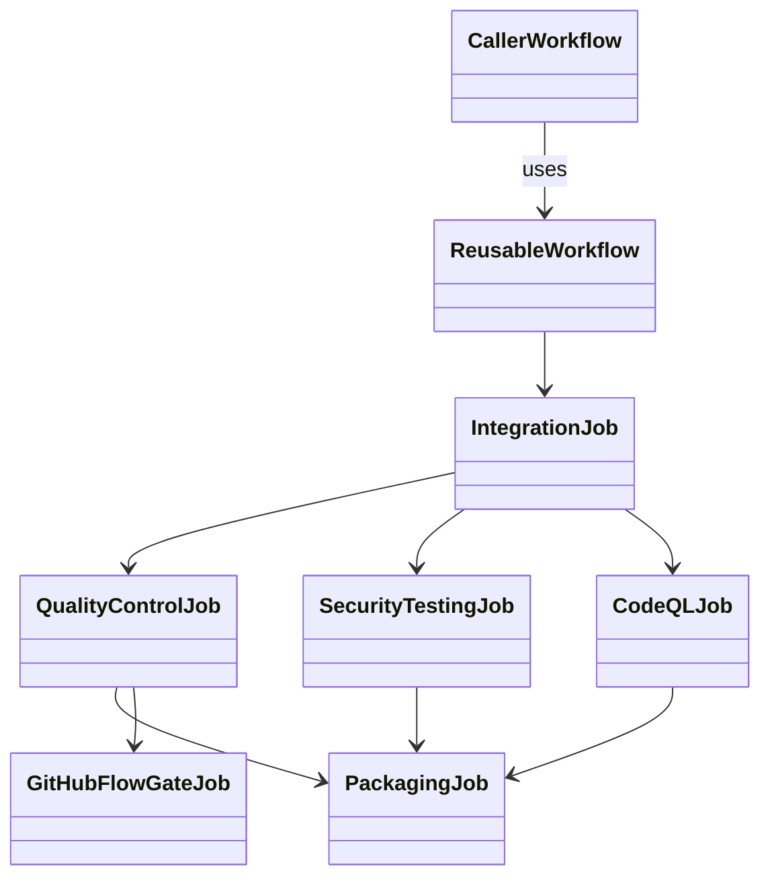

# REASONS Canvas: add-rest-ci-pipeline

**Input analysis:** [add-rest-ci-pipeline.md](../analysis/add-rest-ci-pipeline.md)  
**Behavior contract:** [OpenSpec change](../../openspec/changes/add-rest-ci-pipeline/)

When reality diverges, fix this prompt first — then update the YAML.

---

## R — Requirements

- Three-pipeline GitHub Flow family for the Spring REST API.
- Fast Feedback: Integration only, feature-branch pushes (ignore `master`/`develop`).
- Integration CI: PR/push `develop` + `workflow_dispatch`. Jobs: Assert caller → Integration → (QC ∥ Security ∥ CodeQL) → GitHub Flow CI Gate.
- Release: published GitHub Release **or** PR `develop` → `master`. Same gates + Packaging (WAR + Tomcat image; tar always; GHCR off PR). Image is env-driven: refuse baked `POSTGRES_*` / `SPRING_DATASOURCE_*` / `HAYSTACK_*` / `STRIPE_*` / `APP_JWT_*`; prove dummy runtime env. Do not `COPY` `spring-datasource.env` into the image.
- Java 21 Temurin + `./mvnw`. QC starts Docker `postgres:16-alpine`.
- Integration QC secrets: `REST_API_DB_*` / Environment `integration`.
- Release QC secrets: `REST_API_CLOUD_DB_*` / Environment `production`.
- Specs live under `heavy-rental-rest-api/`.
- This family stops at packaging. Academy CD is `deploy-pipeline/`.

## E — Entities



Artifacts:

| Name | Source |
| --- | --- |
| Maven fingerprint | `pom.xml` |
| Test reports | surefire / failsafe |
| SARIF | `security-reports/semgrep.sarif`, `security-reports/trivy-fs.sarif` |
| Release WAR | versioned + stable copies |
| Release image tar | `heavy-rental-rest-api-v{version}-build{run}-{sha}.tar.gz` |
| GHCR | `ghcr.io/{owner}/heavy-rental-rest-api:{tag}` (not on pull_request) |
| Cloud JDBC env | `release-deploy-config/spring-datasource.env` (no password) |

## A — Approach

- Keep existing YAML. New work is OpenSpec + SPDD + ADR + `specification/`.
- `DEFAULT_APP_REPOSITORY`: `SA62-team1/heavy-rental-spring-rest-api` (act). Installed caller uses the Heavy-Rental Spring repo.

## S — Structure

```
heavy-rental-rest-api/
  specification/
  openspec/
  spdd/
  docs/adr/
  fast-feedback-ci-pipeline/
  integration-pipeline/
  release-pipeline/
  deploy-pipeline/          # CD family — not this canvas
```

Job `name:` values (branch protection):

- `Assert caller`
- `Integration`
- `Quality Control`
- `Security Testing`
- `CodeQL Analysis`
- `GitHub Flow CI Gate`
- `Packaging` (release only)

## O — Operations

1. Document OpenSpec + OpenSPDD + ADRs (this change).
2. Do not add jobs.
3. `actionlint` the six CI files if YAML is later edited.

## N — Norms

- `# ====...====` headers on YAML.
- `set -euo pipefail` on multi-line `run:`.
- No `secrets: inherit`.
- No `environment:` on caller `uses:` jobs.
- Bind `github.*` / `inputs.*` through `env:` inside `run:`.
- SARIF is the security report standard.

## S — Safeguards (negative space)

- **DO NOT** apply Terraform or compose onto `asg-rest` in this family.
- **DO NOT** treat `REST_API_CLOUD_DB_*` as guest SM (`heavy-rental/rest`).
- **DO NOT** bake `POSTGRES_*`, `SPRING_DATASOURCE_*`, `HAYSTACK_*`, `STRIPE_*`, `APP_JWT_*`, or `REST_API_*` into the Release image (`ENV`/`ARG`/`COPY .env`/`--build-arg`).
- **DO NOT** `COPY` `spring-datasource.env` into the image.
- **DO NOT** require `REST_API_DB_URL` as a secret.
- **DO NOT** `docker push` on pull_request events.
- **DO NOT** put `on: push` on reusable files.
- **DO NOT** use Python/uv, Node, or Android SDK as the app toolchain.
- **DO NOT** cancel in-progress Release runs.
- **DO NOT** change Haystack, portal, or mobile pipelines in this change.
